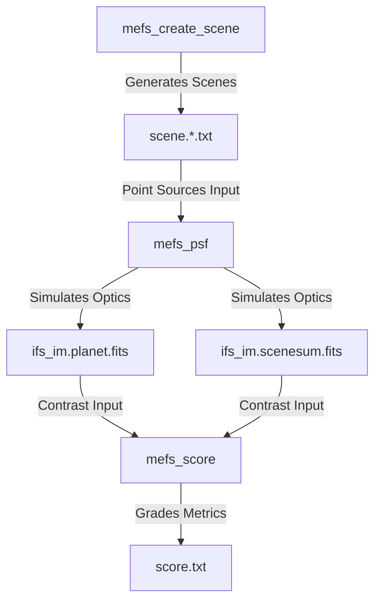

# Matched Electric Field Spectrograph (MEFS) Simulation & Analysis

Welcome to the documentation for the **MEFS Simulation & Analysis Toolkit**. This high-performance,
multi-threaded optical simulation suite is designed to model spatial-spectral speckle calibration
and exoplanet spectroscopy using hybrid coronagraphic and photonic systems.

---

## 1. Instrument Concept & Context

The **Matched Electric Field Spectrograph (MEFS)** is an advanced instrument architecture designed
for high-contrast imaging and high-resolution spectroscopy of exoplanets. It targets future space
missions like the **Habitable Worlds Observatory (HWO)** and ground-based Extremely Large
Telescopes (ELTs).

MEFS utilizes a **2-stage system** that combines a conventional coronagraph with a **Photonic
Integrated Circuit (PIC) spectrograph** using a **photonic lantern (PL)** and a **photonic nulling
chip (PNC)**.

### The 2-Stage Speckle Mitigation Strategy
Classical coronagraphs attempt to suppress starlight to a level of $10^{-10}$ purely through physical
optics. This places extreme, sub-nanometer requirements on wavefront control and mechanical
stability. MEFS relaxes these constraints using a hybrid approach:

1. **Stage 1 (Coronagraph)**: Suppresses the bulk of the starlight to a moderate level ($\sim 10^{-7}$
   contrast reduction).
2. **Stage 2 (Photonic Integrated Circuit)**: Couples the residual light into a photonic lantern
   and nulling chip, relaxing the PIC contrast requirement to only $\sim 10^{-2}$ to $10^{-3}$.
   This decreases the required Field of View (FOV) to $\sim 2\ \lambda/D$, reducing the number of
   spatial channels by $\sim 25\times$ and allowing for broad band spectral multiplexing.

---

## 2. Five Steps to Exoplanet Spectroscopy in MEFS

The MEFS instrument operates via five sequential stages:

1. **Coronagraph Pre-Suppression**: Removes the vast majority of starlight from the optical path.
2. **Speckle Field Identification**: Wide-field imaging using a camera or Integral Field
   Spectrograph (IFS) locates the exoplanet amidst residual speckles.
3. **Photonic Lantern Coupling**: The narrow exoplanet field is injected into a multi-core Photonic
   Lantern (PL), breaking the light down into clean single-mode channels.
4. **Photonic Nulling (PNC)**: Splitting phase shifts separate residual starlight leakage from the
   coherent planetary signal.
5. **Spectral Dispersion & Self-Calibration**: Planet channels are dispersed onto the science
   spectrograph, while starlight leakage channels feed wavefront sensing algorithms for real-time
   closed-loop tracking and calibration (achieving up to $50\ \mu\text{as}$ precision per spectral
   bin).

---

## 3. Toolkit Architecture & Components

The simulation suite mimics this optical pipeline through three core executables:

### 1. `mefs_create_scene`
A scene generator that constructs astronomical targets as collections of point sources:
* **Planets**: Point sources with customizable off-axis offsets ($x, y$ in $\lambda/D$) and fluxes.
* **Circumstellar Dust Disks**: Power-law exozodi disks projected at a realistic inclined geometry
  (defaulting to the statistical median inclination of $60.0^{\circ}$).
* **Stellar Disks**: Uniform circular disks modeling resolved stellar photospheres.

### 2. `mefs_psf`
A multi-threaded, OpenMP-accelerated physical optics propagator:
* Simulates wavefront propagation through custom pupil designs and coronagraph layouts.
* Simulates the Integral Field Spectrograph (IFS) lenslet array and pinhole masks.
* Performs matched-filter MEFS projection mode simulations to model PIC coupling coefficients.
* Integrates World Coordinate System (WCS) headers directly into output FITS arrays.
* Supports incremental batch runs (skipping pre-computed files while maintaining correct sums).

### 3. `mefs_score`
An analysis and evaluation utility:
* Reads simulated exoplanet flux maps and combined background sums.
* Translates pixel coordinates using WCS headers to match planet locations.
* Grades detection metrics and produces an intensity-ordered contrast score list (`score.txt`).

---

## 4. Current Status & On-Sky Demonstrations

The technology behind MEFS is actively developed and tested at the **Subaru Telescope** using the
**SCExAO** instrument:
* **GLINT (Guided Light Interferometric Nulling Technology)**: On-sky demonstrations (as of May 2025)
  have validated photonic nulling, wavefront sensing, and closed-loop operation using chip-based
  tricouplers with high throughput ($\sim 80\%$).
* **FIRST / Photonic Lantern**: Demonstrated sub-diffraction-limited astronomical measurements
  through photonic lantern coupling and spatial-spectral self-calibration on-sky (*Yoo Jung Kim et
  al. 2025 ApJL*).
