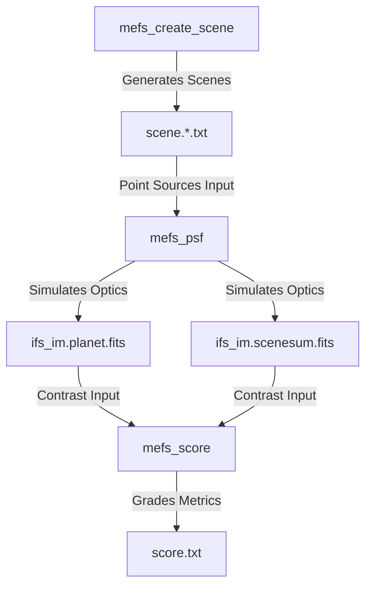

# MEFS Simulation & Analysis Toolkit

Welcome to the documentation for the **MEFS Toolkit**, a high-performance, multi-threaded
astronomical Coronagraphic Point Spread Function (PSF) and Integral Field Spectrograph (IFS)
simulation suite.

This toolkit is designed to simulate physical optics through high-contrast imaging systems and
evaluate detection contrast metrics for exoplanets, circumstellar zodiacal dust disks, and resolved
stellar disks.

---

## Toolkit Architecture

The MEFS Toolkit is comprised of three core components:

1. **`mefs_create_scene`**: A scene generator program that constructs custom or default astronomical
   benchmark components (including stars, zodiacal dust, inclined exozodiacal disks, and exoplanets)
   as normalized collections of point sources.
2. **`mefs_psf`**: A multi-threaded, OpenMP-accelerated optics simulator. It takes point source scene
   files, propagates them through a coronagraph and an Integral Field Spectrograph (IFS), and writes
   intensity and flux map FITS files.
3. **`mefs_score`**: An analysis utility that reads the planet flux map and combined scene sum flux
   maps, translates pixel coordinates using WCS headers, and grades detection metrics to construct
   an intensity-ordered cumulative contrast score file.

---

## Features

- **Multi-threaded Point Propagation**: Spawns multiple threads using OpenMP, achieving a ~10x speedup
  on multi-core CPUs.
- **Unified WCS Header Support**: Integrates World Coordinate System WCS cards directly into output
  FITS arrays to allow down-stream analysis programs to read pixel sampling scales automatically.
- **Skip-on-Exist Incrementals**: Incremental batch mode scans local files, processes them, and
  writes overall sum images (`*.scenesum.fits`). It skips existing files but reads their FITS images
  from disk to integrate them correctly into the final sum.
- **Statistical Median Inclination**: Projects exozodiacal disks at a realistic inclined geometry
  (defaulting to the statistical median inclination of \(60.0^{\circ}\)).
- **Unified Color Styling**: Consistently implements the MEFS Unified Help Message standard with ANSI
  styling and `NO_COLOR` support.
